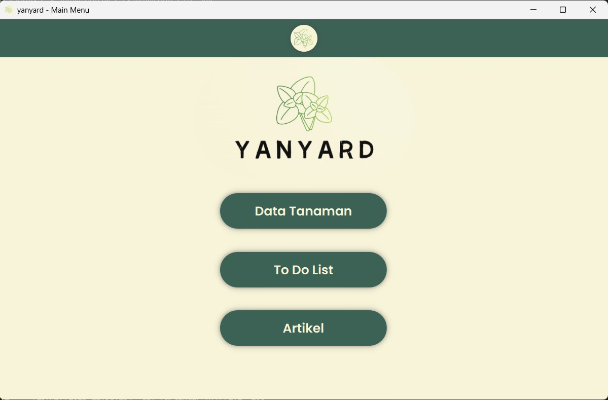
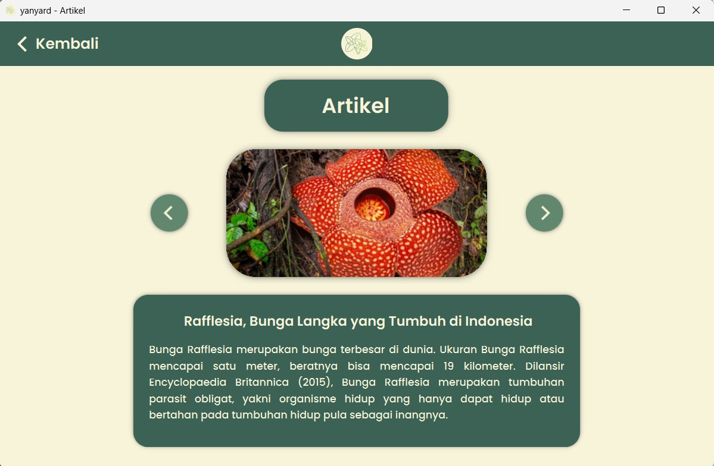
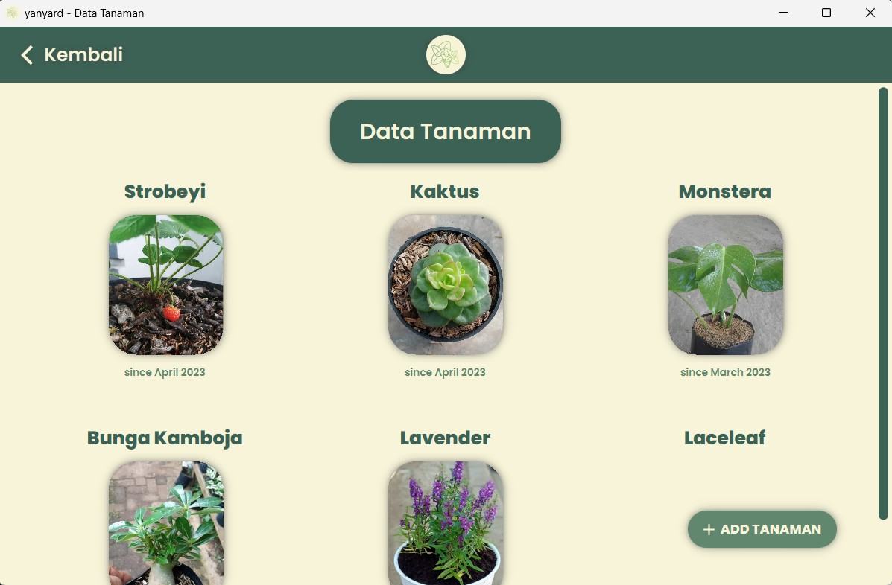
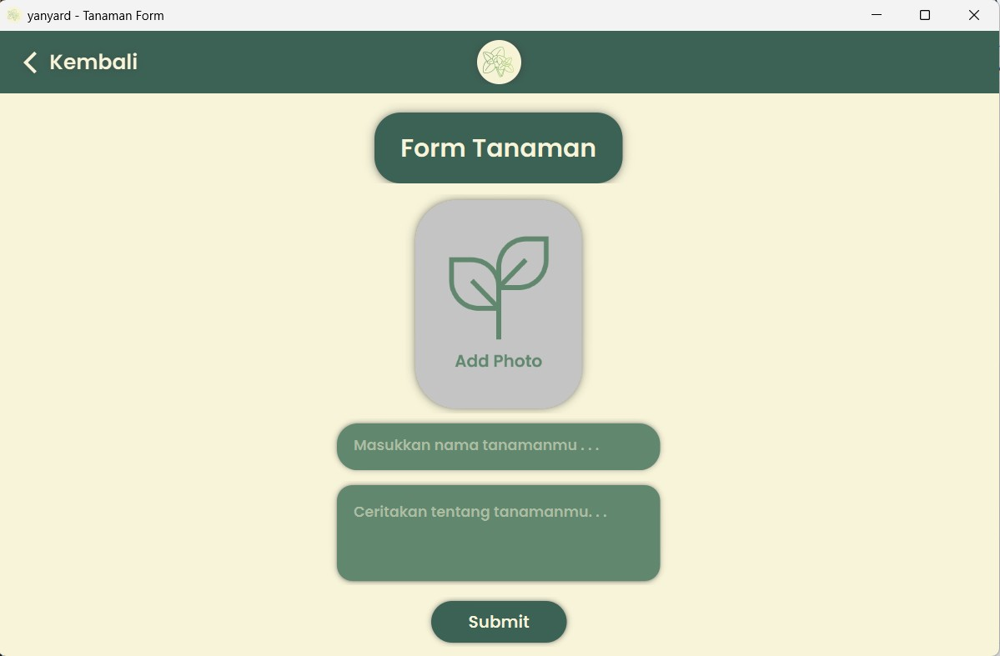
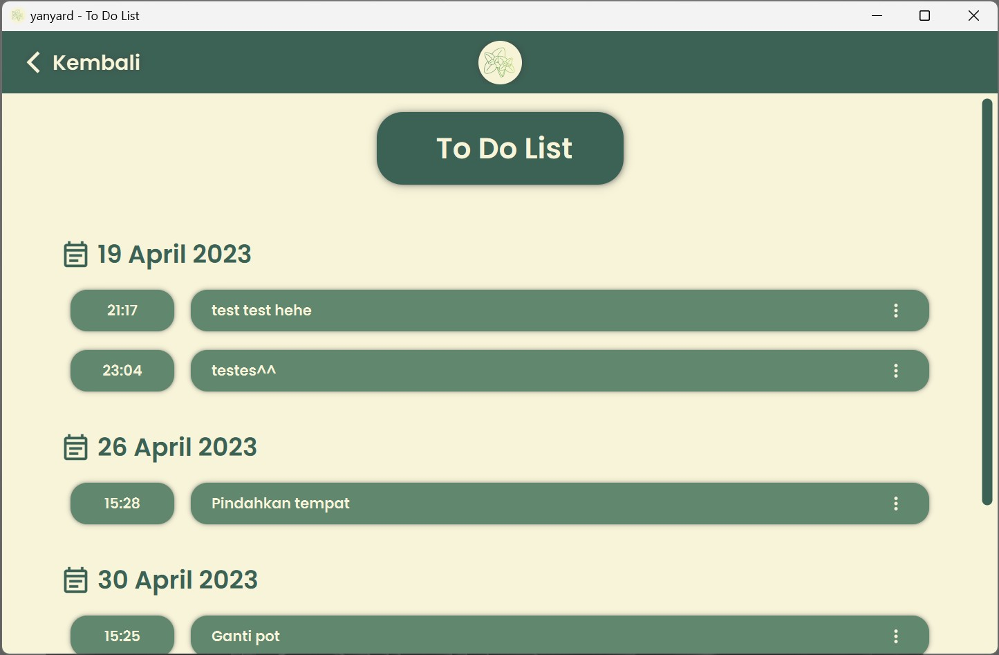
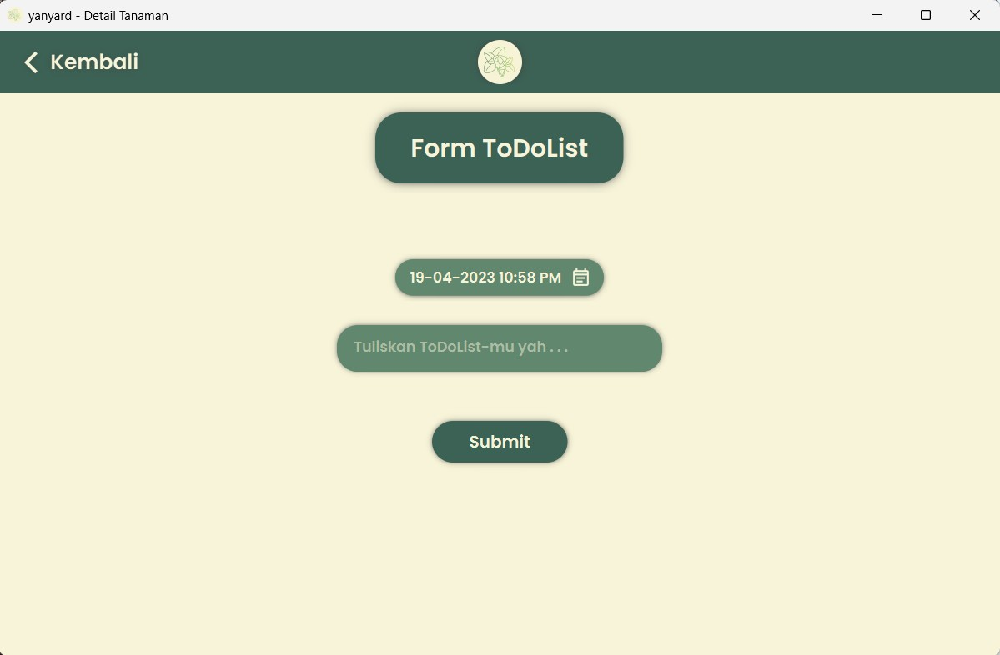
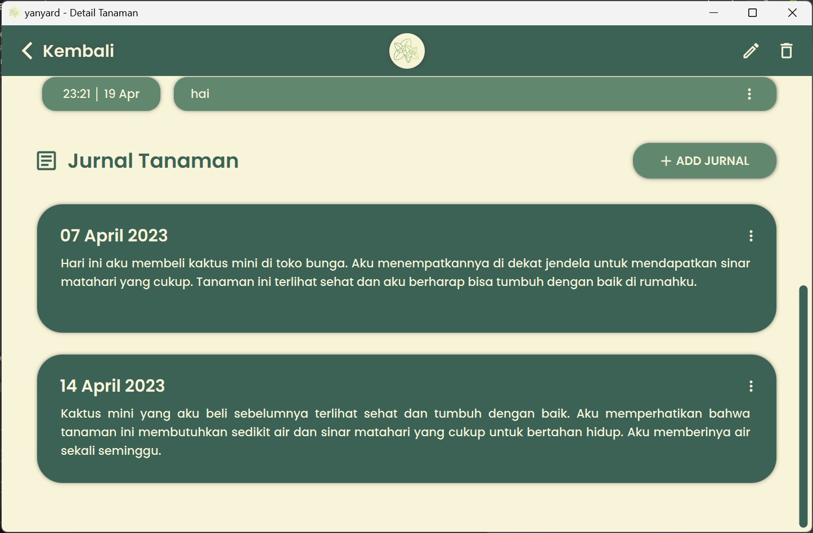
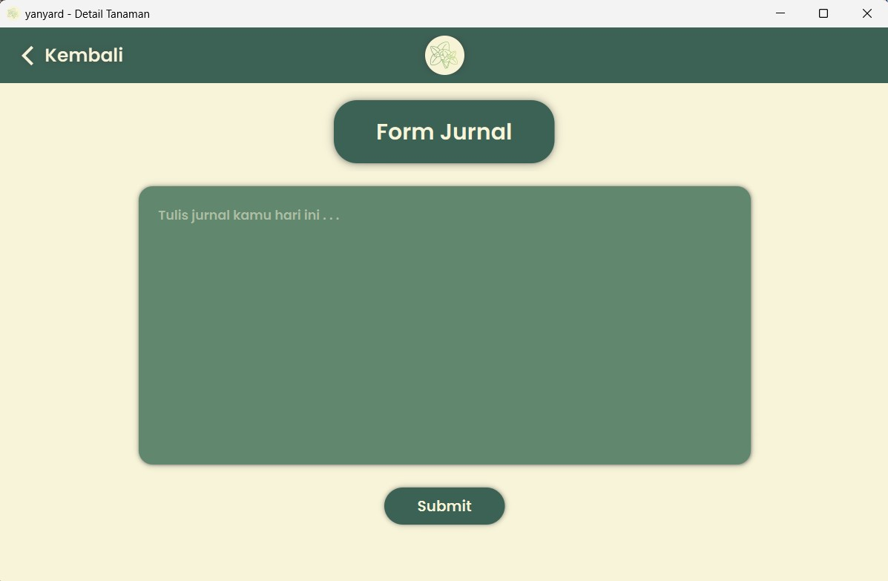

# yanyard - Aplikasi Jurnal Tanaman

## Daftar Isi

- [Deskripsi Aplikasi](#deskripsi-aplikasi)
- [Teknologi yang Digunakan](#teknologi-yang-digunakan)
- [Daftar Modul](#daftar-modul)
- [Daftar Basis Data](#daftar-basis-data)
- [Cara Menjalankan Aplikasi](#cara-menjalankan-aplikasi)
- [Anggota Kelompok dan Pembagian Tugas](#anggota-kelompok-dan-pembagian-tugas)

## Deskripsi Aplikasi

yarnyard adalah aplikasi berkebun yang dapat membantu user dalam kegiatan berkebun, mulai dari mencatat semua jenis tanaman, mencatat perkembangan tanaman, hingga menambahkan to-do list sebagai reminder. Perangkat lunak ini dibuat untuk memenuhi kebutuhan masyarakat yang memiliki hobi maupun ingin bercocok-tanam. Perangkat lunak ini menyediakan beberapa fitur untuk mempermudah masyarakat dalam menjadwal kebutuhan tanaman serta menyimpan perkembangan tanaman.

Aplikasi ini memiliki beberapa fitur, yaitu:

- Menambah dan Menghapus Tanaman <br>
  Fitur ini digunakan untuk menambahkan tanaman yang baru ditanam serta menghapus tanaman yang sudah layu.
- Jurnal Progress Tanaman <br>
  Jurnal progress ini berguna untuk mencatat tanaman yang dimiliki serta perkembangan tanaman. Kelebihan dari jurnal progress ini adalah user dapat mengunggah foto ke dalam journal.
- Daily To-do-list <br>
  Daily to-do-list ini akan berisi jadwal penyiraman, pemupukan, ataupun kegiatan lain yang perlu dilakukan untuk merawat tanaman tersebut. Nantinya, daily to-do list ini akan menjadi reminder untuk user melalui notifikasi.
- Artikel Seputar Tanaman <br>
  User dapat membaca artikel seputar tanaman secara spesifik maupun general. Artikel ini dapat berguna bagi masyarakat yang ingin mencari-tahu informasi seperti kebutuhan tanaman, tata cara merawat tanaman, dan sebagainya.

## Teknologi yang Digunakan

Bahasa pemrograman : Python 3 <br>
Paradigma pemrograman : Object Oriented <br>

DBMS : MySQL <br>
Backend : Flask <br>
GUI : PyQt <br>

## Daftar Modul

### Menu Utama

Modul menu utama digunakan untuk menampilkan tampilan utama dari aplikasi



### Artikel

Modul artikel digunakan untuk menampilkan artikel



### Tanaman

Modul tanaman digunakan untuk menampilkan list tanaman, detail setiap tanaman, serta operasi CRUD terkait data tanaman




### To Do List

Modul to-do-list digunakan untuk menampilkan to–do-list semua tanaman, to-do-list setiap tanaman, serta operasi CRUD terkait data to-do-list




### Jurnal

Modul jurnal digunakan untuk menampilkan jurnal tanaman serta operasi CRUD terkait data jurnal




## Daftar Basis Data

### artikel

| Field       | Type         | Null | Key | Default | Extra          | Desc                         |
| ----------- | ------------ | ---- | --- | ------- | -------------- | ---------------------------- |
| id_artikel  | int(11)      | NO   | PRI | NULL    | auto_increment | Menyimpan ID unik artikel    |
| judul       | varchar(50)  | NO   |     | NULL    |                | Menyimpan judul artikel      |
| isi_artikel | text         | NO   |     | NULL    |                | Menyimpan isi/konten artikel |
| gambar      | varchar(255) | NO   |     | NULL    |                | Menyimpan gambar artikel     |

### jurnal

| Field            | Type         | Null | Key | Default | Extra          | Desc                               |
| ---------------- | ------------ | ---- | --- | ------- | -------------- | ---------------------------------- |
| id_jurnal        | int(11)      | NO   | PRI | NULL    | auto_increment | Menyimpan ID unik jurnal           |
| id_tanaman       | int(11)      | NO   | MUL | NULL    |                | Menyimpan ID unik tanaman          |
| tanggal_jurnal   | date         | NO   |     | NULL    |                | Menyimpan tanggal pembuatan jurnal |
| deskripsi_jurnal | varchar(255) | NO   |     | NULL    |                | Menyimpan deskripsi jurnal         |

### tanaman

| Field             | Type         | Null | Key | Default | Extra          | Desc                                |
| ----------------- | ------------ | ---- | --- | ------- | -------------- | ----------------------------------- |
| id_tanaman        | int(11)      | NO   | PRI | NULL    | auto_increment | Menyimpan ID unik tanaman           |
| nama_tanaman      | varchar(50)  | NO   |     | NULL    |                | Menyimpan nama tanaman              |
| tanggal_tanaman   | date         | NO   |     | NULL    |                | Menyimpan tanggal penanaman tanaman |
| deskripsi_tanaman | varchar(255) | YES  |     | NULL    |                | Menyimpan deskripsi tanaman         |
| gambar            | varchar(255) | YES  |     | NULL    |                | Menyimpan gambar tanaman            |

### todolist

| Field         | Type         | Null | Key | Default | Extra          | Desc                                |
| ------------- | ------------ | ---- | --- | ------- | -------------- | ----------------------------------- |
| id_tdl        | int(11)      | NO   | PRI | NULL    | auto_increment | Menyimpan ID unik to-do-list        |
| id_tanaman    | int(11)      | NO   | MUL | NULL    |                | Menyimpan ID unik tanaman           |
| waktu         | datetime     | NO   |     | NULL    |                | Menyimpan waktu reminder to-do-list |
| deskripsi_tdl | varchar(255) | NO   |     | NULL    |                | Menyimpan deskripsi to-do-list      |

## Cara Menjalankan Aplikasi

### 1. Clone repository

```sh
git clone https://gitlab.informatika.org/bangkitdc/if2250-2023-k01-g09-yanyard.git
```

### 3. Run the app

Pastikan telah menginstall Python, kemudian jalankan command berikut

```sh
python src/main.py
```

## Anggota Kelompok dan Pembagian Tugas

| NIM      | Nama                           | Pembagian Tugas |
| -------- | ------------------------------ | --------------- |
| 13521055 | Muhammad Bangkit Dwi Cahyono   | Jurnal Tanaman  |
| 13521063 | Salomo Reinhart Gregory Manalu | Detail Tanaman  |
| 13521071 | Margaretha Olivia Haryono      | To-Do-List      |
| 13521081 | Bagas Aryo Seto                | List Tanaman    |
| 13521103 | Aulia Mey Diva Annandya        | Detail Tanaman  |
